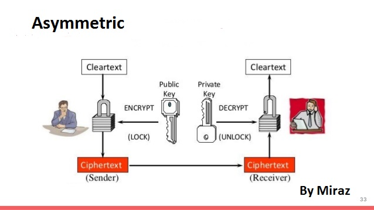

# Creativity-Change-the-World
Creativity creates innovations, Innovation Change the Behavior of World.

World want to change ! Change occure, when behaviour changes. Due to this Fact, A new technlogy come into the world known as BlockChain.
Any One Knows about it ? 
oops No. now i m going to tell you something about it that are very intersting. Block Chain is the combination of Blocks. so the question is what is block ?
Block is a combination of Data, Hash of current, Hash of Previous Block. Its very Simillar with Double Linked List.

Why BlockChain ? 
Only one reason it does not allow to temper the data. and as well as no one can do something wrong now on social media. its a Decentralized Networks where each node serve as a Distributed Server.
Example: BlockChain =Block + Block + …… + n.

BlockChain Categories into three classification: Public , Private , Consortium or Federated. Public Blockchain scope all over the public anyone can visit and look at the transactions becuase of Decentralized Newtwork.
Where as the Private BlocChain is only the Specific person can See the Transactions, where we specified some layer of organization, only specific layer person can look at the Transaction.
where as Consortium means when 50% people agree to allow the request to see the result, then request be granted.otherwise not.
We Use Some Important Terms in BlockChain. Like ICO and IPO, ICO refers to the concept where we do some Initial Coin Offering. means we are going to introduce some new digital coin in the era. but we have no fund to start it so we do ICO that help us to collect funds from investors , investor holds the Coin when its value incresing then we give them some rewards in the form of Digital Coin.
BlockChain has some Challenges, Like how we can communicate to others securely!, if some middle man get our Shared Secret :O, then it will leads to our investment into destruction.
to Overcome this Challenge another Concept comes in the world that is Symetric and Asymetric. 
In Symetric, We have one Shared secret that both the parties holds and communicate with each other Securly! and it is possible when we are follwing Deffi helmin Algorithm.
on Another Hand we have ASymeteric Concept where we have one Public Key, One Private Key. One key For Encryption and then Second Key is for Decryption.

